# Graphs — Lesson 18 (Notes)

> Adapted from **L18 Slides – Graphs**. These notes condense the key ideas and add runnable code examples. fileciteturn0file0

## Agenda
- Introduction to the graph data structure
- Types of graphs and key terms
- Implementations
- Traversal algorithms (BFS, DFS)
- Shortest paths
- Cycle detection
- Practice tasks

---

## 1) What is a Graph?
A **graph** is a set of **vertices (nodes)** and **edges** connecting those vertices.  
Two vertices are **adjacent** if an edge connects them. fileciteturn0file0

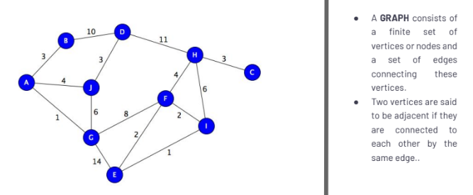

**Real-world uses:** social networks, games, travel maps, routing, and more. fileciteturn0file0
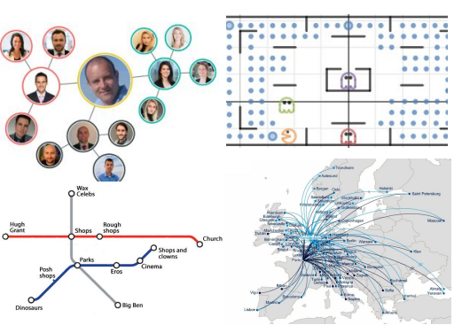

```text
V = {A, B, C, D}
E = {(A,B), (A,C), (B,D), (C,D)}
```
V = vertices
E = edges, linking the vertices

---

## 2) Glossary & Types
Key definitions you should know. fileciteturn0file0

- **Order**: number of vertices in the graph.
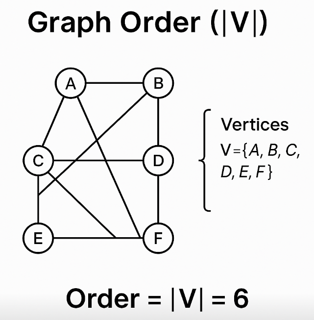  
- **Size**: number of edges in the graph.  
  
- **Vertex degree**: number of edges that are incident to a vertex. 
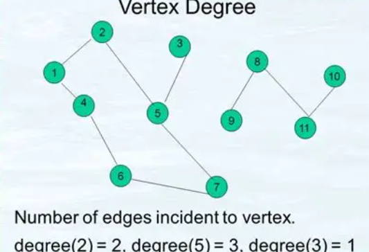  
- **Isolated vertex**: vertex with no incident edges. 
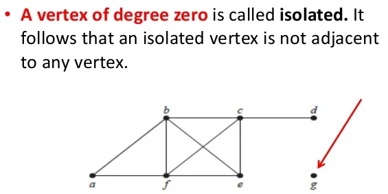   
- **Self-loop**: edge from a vertex to itself.  
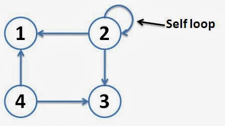   
- **Directed graph (digraph)**: edges have direction *u → v* (a starting vertex ans an end vertex).
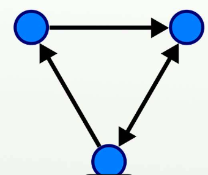    
- **Undirected graph**: edges have no direction.  
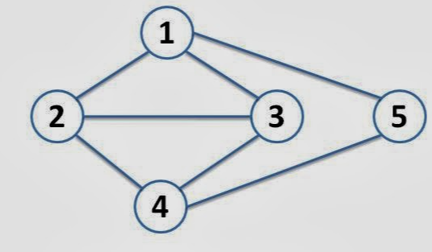  
- **Weighted / Unweighted**: edges may carry numeric weights (costs).  weighted = has weighting
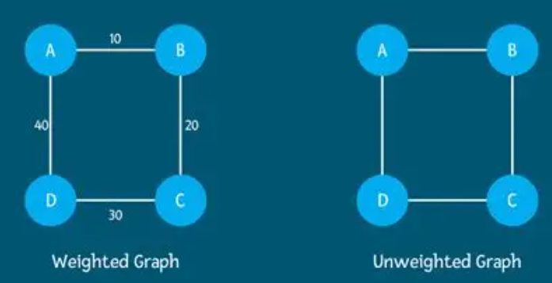 
- **Graph cycle**: a cycle occurs when three or more vertices in the graph are connected so as to form a closed group
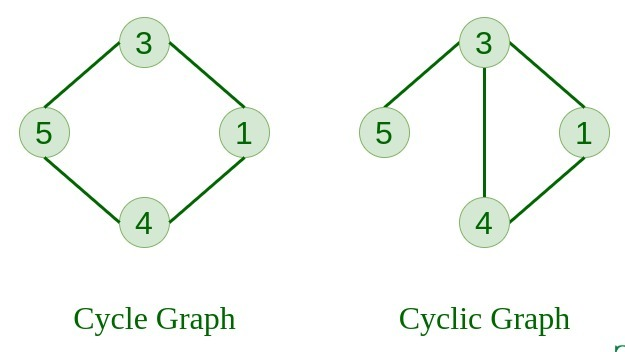 
- **Cycle**: a path that starts and ends at the same vertex.  
- **Acyclic / Cyclic**: absence/presence of cycles.  
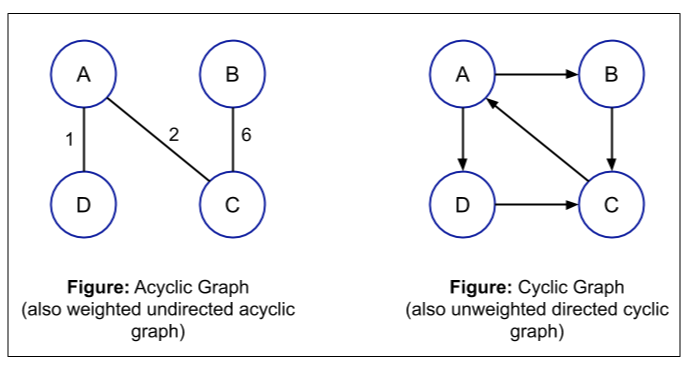 
- **Connected (undirected)**: graph is connected if for every pair of vertices in the graph
there is a path of one or more edges connecting the given vertices.  

---

## 3) Graph Representations
Two common ways to store graphs.

### 3.1 Adjacency List
It’s a way to store a graph as a map from each vertex to the list of its neighbors.
- Space: **O(V + E)**
- Great for **sparse** graphs.
- Easy to iterate neighbors.

**example (undirected)**
A—B
|\ |
| \|
C—D

**example: Adjacency List)**
A: [B, C]
B: [A, D]
C: [A, D]
D: [B, C]

**Why space is O(V + E)**
- You store each vertex once → contributes the V.
- You store each edge in a neighbor list (twice for undirected, once for directed) → contributes the E.
- Constants (like “twice”) don’t change big-O, so total ≈ V + E.

**Why it’s great for sparse graphs**
- Sparse ≈ not many edges compared to the maximum possible (E << V²).
- If most pairs of vertices are not connected, you don’t waste space listing a bunch of zeros like you would in a matrix. You only store the actual connections.

**Why it’s easy to iterate neighbors**
- To see who’s next to u, you just read adj[u].
- Time to iterate is O(degree(u)) (only the real neighbors), not O(V).


**Python (Adjacency List):**
```python
from collections import defaultdict

class Graph:
    def __init__(self, directed=False):
        self.adj = defaultdict(list)
        self.directed = directed

    def add_edge(self, u, v, w=1):
        self.adj[u].append((v, w))
        if not self.directed:
            self.adj[v].append((u, w))

g = Graph(directed=False)
g.add_edge("A", "B")
g.add_edge("A", "C")
g.add_edge("B", "D")
g.add_edge("C", "D")
print(dict(g.adj))
```

**JavaScript (Adjacency List):**
```javascript
class Graph {
  constructor(directed=false) {
    this.directed = directed;
    this.adj = new Map(); // vertex -> array of {to, w}
  }
  addVertex(v) {
    if (!this.adj.has(v)) this.adj.set(v, []);
  }
  addEdge(u, v, w=1) {
    this.addVertex(u); this.addVertex(v);
    this.adj.get(u).push({ to: v, w });
    if (!this.directed) this.adj.get(v).push({ to: u, w });
  }
}
const g = new Graph(false);
g.addEdge("A","B"); g.addEdge("A","C"); g.addEdge("B","D"); g.addEdge("C","D");
console.log(g.adj);
```

**Quick compare (why not a matrix?)**

*Adjacency matrix:* fast edge check O(1), but neighbor iteration is O(V) and space is O(V²) (wasteful for sparse graphs).

*Adjacency list:* edge check is O(degree(u)), but neighbor iteration is O(degree(u)) and space is only O(V+E).

So, that bullet basically means: “Adjacency lists store exactly what you need, take space proportional to the actual graph, and make walking to each node’s neighbors straightforward and efficient.”


### 3.2 Adjacency Matrix
A` V × V` table where cell `(i, j)` tells you whether there’s an edge from vertex `i` to vertex `j` (or its weight).
- Space: **O(V²)** - you store a full table regardless of how many edges exist.
- Great for **dense** graphs. - when lots of pairs are connected, the table isn’t “wasted”.
- Instant edge lookup `O(1)`.- heck one cell to see if an edge exists (or to get its weight)

```python
# 0/1 matrix example
import numpy as np

labels = ["A","B","C","D"]
index = {v:i for i,v in enumerate(labels)}
n = len(labels)
M = [[0]*n for _ in range(n)]

def add_edge_matrix(M, index, u, v, directed=False):
    M[index[u]][index[v]] = 1
    if not directed:
        M[index[v]][index[u]] = 1

add_edge_matrix(M, index, "A","B")
add_edge_matrix(M, index, "A","C")
add_edge_matrix(M, index, "B","D")
add_edge_matrix(M, index, "C","D")

for row in M:
    print(row)
```
[0, 1, 1, 0]
[1, 0, 0, 1]
[1, 0, 0, 1]
[0, 1, 1, 0]
- Row = source, column = destination. Symmetric because it’s undirected.

**When to use a matrix vs a list**

- Matrix: dense graphs, constant-time edge checks, or mathy operations (linear algebra tricks, bitsets).
- List: sparse graphs; you only store real edges; iterating neighbors is fast (`O(degree(u))` vs `O(V)` for a matrix).

**Common Operations**
```js
// Labels and index map
const labels = ["A", "B", "C", "D"];
const idx = Object.fromEntries(labels.map((v, i) => [v, i]));

// Build a 0/1 adjacency matrix
const n = labels.length;
const M = Array.from({ length: n }, () => Array(n).fill(0));

function addEdgeMatrix(M, idx, u, v, directed = false) {
  M[idx[u]][idx[v]] = 1;
  if (!directed) M[idx[v]][idx[u]] = 1;
}

// --- Helpers ---

// Edge lookup (O(1))
function hasEdge(M, u, v) {
  return M[idx[u]][idx[v]] === 1;
}

// Degree of a node in an unweighted, undirected graph (sum the row)
function degree(M, u) {
  return M[idx[u]].reduce((sum, val) => sum + val, 0);
}

// Iterate neighbors of u (O(V))
function neighbors(M, u) {
  const i = idx[u];
  const row = M[i];
  const nbrs = [];
  for (let j = 0; j < row.length; j++) {
    if (row[j]) nbrs.push(labels[j]);   // use `row[j] > 0` if using weights
  }
  return nbrs;
}

// --- Demo ---
addEdgeMatrix(M, idx, "A", "B");
addEdgeMatrix(M, idx, "A", "C");
addEdgeMatrix(M, idx, "B", "D");
addEdgeMatrix(M, idx, "C", "D");

console.log("Matrix:", M);
console.log("hasEdge(A, B):", hasEdge(M, "A", "B")); // true
console.log("degree(A):", degree(M, "A"));           // 2
console.log("neighbors(A):", neighbors(M, "A"));     // ["B", "C"]
```

**Weighted version**

Store numbers instead of 0/1:

```python
# 0 means no edge; positive numbers are weights
M = [[0]*n for _ in range(n)]

def add_weighted(M, idx, u, v, w, directed=False):
    M[idx[u]][idx[v]] = w
    if not directed:
        M[idx[v]][idx[u]] = w

```
---

## 4) Traversals
Two foundational ways to explore graphs. (Slides: BFS & DFS.) fileciteturn0file0

### 4.1 Breadth-First Search (BFS)
**Idea:** explore neighbors level-by-level.  
**Use cases:** shortest paths in **unweighted** graphs, social network layers, minimum spanning-tree roots. fileciteturn0file0


**Python (BFS on adjacency list):**
```python
from collections import deque

def bfs(graph_adj, start):
    visited = set([start])
    parent = {start: None}
    q = deque([start])
    order = []

    while q:
        u = q.popleft()
        order.append(u)
        for v, _w in graph_adj.get(u, []):
            if v not in visited:
                visited.add(v)
                parent[v] = u
                q.append(v)
    return order, parent

order, parent = bfs(dict(g.adj), "A")
print("BFS order:", order)
print("Parents:", parent)
```

**JavaScript (BFS):**
```javascript
function bfs(adj, start) {
  const visited = new Set([start]);
  const parent = new Map([[start, null]]);
  const q = [start];
  const order = [];

  while (q.length) {
    const u = q.shift();
    order.push(u);
    for (const {to} of (adj.get(u) || [])) {
      if (!visited.has(to)) {
        visited.add(to);
        parent.set(to, u);
        q.push(to);
      }
    }
  }
  return { order, parent };
}
```

### 4.2 Depth-First Search (DFS)
**Idea:** go as deep as possible, then backtrack.  
**Use cases:** path finding, cycle detection, topological sort, maze solving. fileciteturn0file0


**Python (Recursive DFS):**
```python
def dfs_recursive(graph_adj, start, visited=None, order=None):
    if visited is None: visited = set()
    if order is None: order = []
    visited.add(start)
    order.append(start)
    for v, _w in graph_adj.get(start, []):
        if v not in visited:
            dfs_recursive(graph_adj, v, visited, order)
    return order

print("DFS (recursive):", dfs_recursive(dict(g.adj), "A"))
```

**Python (Iterative DFS):**
```python
def dfs_iterative(graph_adj, start):
    visited = set()
    order = []
    stack = [start]
    while stack:
        u = stack.pop()
        if u in visited: 
            continue
        visited.add(u)
        order.append(u)
        for v, _w in reversed(graph_adj.get(u, [])):  # reversed for similar order to recursive
            if v not in visited:
                stack.append(v)
    return order

print("DFS (iterative):", dfs_iterative(dict(g.adj), "A"))
```

**JavaScript (Recursive DFS):**
```javascript
function dfsRecursive(adj, start, visited=new Set(), order=[]) {
  visited.add(start);
  order.push(start);
  for (const {to} of (adj.get(start) || [])) {
    if (!visited.has(to)) dfsRecursive(adj, to, visited, order);
  }
  return order;
}
```

---

## 5) Shortest Path
**Goal:** minimize total weight (or number of edges if unweighted).  
Common algorithms: **Dijkstra** (non-negative weights), **Bellman–Ford** (handles negative edges). fileciteturn0file0


### Example
```js
const graphElements = {
  a: ['b', 'c', 'd'],
  b: ['a', 'e', 'f'],
  c: ['a', 'f', 'g'],
  d: ['a', 'g', 'h'],
  e: ['b', 'i'],
  f: ['b', 'c', 'j'],
  g: ['c', 'd', 'j'],
  h: ['d', 'i'],
  i: ['e', 'h', 'j'],
  j: ['f', 'g', 'i']
}

const findShortestPath = (graph, start, end, path = []) => {
  path = [...path, start]
  if (start === end) {
    return path
  }
  let shortest = null
  graph[start].forEach((node) => {
    if (!path.includes(node)) {
      const new_path = findShortestPath(graph, node, end, path)
      if (new_path) {
        if (!shortest || new_path.length < shortest.length) {
          shortest = new_path
        }
      }
    }
  })
  return shortest
}

// Find the shortest path between d and c nodes
console.log(findShortestPath(graphElements, 'g', 'f'))
```

### 5.1 Dijkstra (Python)
```python
import heapq

def dijkstra(graph_adj, source):
    dist = {v: float('inf') for v in graph_adj}
    dist[source] = 0
    parent = {source: None}
    pq = [(0, source)]

    while pq:
        d, u = heapq.heappop(pq)
        if d != dist[u]: 
            continue
        for v, w in graph_adj.get(u, []):
            nd = d + w
            if nd < dist.get(v, float('inf')):
                dist[v] = nd
                parent[v] = u
                heapq.heappush(pq, (nd, v))
    return dist, parent

# weighted demo
wg = Graph(directed=False)
wg.add_edge("A","B",4)
wg.add_edge("A","C",2)
wg.add_edge("B","C",1)
wg.add_edge("B","D",5)
wg.add_edge("C","D",8)
wg.add_edge("C","E",10)
wg.add_edge("D","E",2)

dist, parent = dijkstra(dict(wg.adj), "A")
print("Distances:", dist)
```

### 5.2 Reconstructing a Path
```python
def reconstruct(parent, target):
    path = []
    cur = target
    while cur is not None:
        path.append(cur)
        cur = parent.get(cur)
    return list(reversed(path))

print("Path A -> E:", reconstruct(parent, "E"))
```

### 5.3 Bellman–Ford (Sketch)
- Relax all edges `V-1` times.  
- Detect a negative cycle with one extra relaxation pass.  
- Time: **O(V·E)**.

```python
def bellman_ford(edges, vertices, source):
    dist = {v: float('inf') for v in vertices}
    dist[source] = 0
    parent = {source: None}
    for _ in range(len(vertices)-1):
        updated = False
        for u, v, w in edges:
            if dist[u] + w < dist[v]:
                dist[v] = dist[u] + w
                parent[v] = u
                updated = True
        if not updated:
            break
    # negative-cycle check
    for u, v, w in edges:
        if dist[u] + w < dist[v]:
            raise ValueError("Negative cycle detected")
    return dist, parent
```

---

## 6) Cycle Detection
A **cycle** starts and ends at the same vertex. Uses include deadlock detection and distributed algorithms. fileciteturn0file0


**Undirected (DFS, track parent):**
```python
def has_cycle_undirected(adj):
    visited = set()
    def dfs(u, parent):
        visited.add(u)
        for v,_ in adj.get(u, []):
            if v == parent: 
                continue
            if v in visited or dfs(v, u):
                return True
        return False
    for u in adj:
        if u not in visited and dfs(u, None):
            return True
    return False
```

**Directed (DFS colors):**
```python
def has_cycle_directed(adj):
    WHITE, GRAY, BLACK = 0, 1, 2
    color = {u: WHITE for u in adj}
    def dfs(u):
        color[u] = GRAY
        for v,_ in adj.get(u, []):
            if color.get(v, WHITE) == GRAY:  # back-edge
                return True
            if color.get(v, WHITE) == WHITE and dfs(v):
                return True
        color[u] = BLACK
        return False
    return any(dfs(u) for u in list(adj) if color[u] == WHITE)
```

---

## 7) Complexity Cheat Sheet
- **BFS/DFS:** `O(V + E)`  
- **Dijkstra (binary heap):** `O((V + E) log V)`  
- **Bellman–Ford:** `O(V·E)`  
- **Adjacency list:** space `O(V + E)`  
- **Adjacency matrix:** space `O(V²)`

---

## 8) Practice Tasks
1) Build an undirected, unweighted graph from edge pairs and run BFS from a given start. Return distances (in edges).  
2) Convert an adjacency list to an adjacency matrix (and back).  
3) Implement Dijkstra and print both distances and paths from a source.  
4) Write `has_cycle_undirected` and test on a graph with and without cycles.  
5) For a **directed acyclic graph (DAG)**, implement **topological sort** using DFS or Kahn’s algorithm.  
6) Bonus: Implement **Bellman–Ford**, then show it raises on a negative cycle.

---

### Tips
- Choose adjacency **list** unless you truly need `O(1)` edge checks for dense graphs.  
- For unweighted shortest paths, BFS is enough.  
- Avoid Dijkstra if you have **negative** edges; use Bellman–Ford instead.  
- Keep functions pure. Pass structures in; return results out.

### Implementation
```js
/*
Basic operations that we can perform on a GRAPH:

1. Create a graph
2. Display graph vertices
3. Display graph edges
4. Add a vertex
5. Add an edge
*/

/*
1. Create a graph

   Example of a graph that we want to build
       a________b
       |        |
       |        |
      c|________|d
                |
                |
                |e 

*/

const graphElements = {
  a: ['b', 'c'],
  b: ['a', 'd'],
  c: ['a', 'd'],
  d: ['e'],
  e: ['d'],
}

class Graph {
  constructor(gObj = []) {
    this.gObj = gObj
  }

  // Display vertices
  get vertices() {
    return Object.keys(this.gObj)
  }

  // Display Graph Edges
  get edges() {
    // Create an empty list of edges
    const edges = []
    // Iterate through the edge value for each vertex
    this.vertices.forEach((vertex) => {
      this.gObj[vertex].forEach((nextVertex) => {
        if (!edges.includes(new Set(nextVertex, vertex))) {
          // add to the list
          edges.push(new Set(nextVertex, vertex))
        }
      })
    })
    return edges
  }

  //   Add vertex
  set vertex(vertex) {
    if (!this.vertices.includes(vertex)) {
      this.gObj[vertex] = []
    }
  }

//   add edge
  set edge(edge){
    edge = new Set(edge)
    const [vrtx1,vrtx2] = Array.from(edge)
    if(this.vertices.includes(vrtx1)){
        this.gObj[vrtx1].push(vrtx2)
    } else {
        this.gObj[vrtx1]=[vrtx2]
    }
  }
}

const g = new Graph(graphElements)
g.vertex = "f"

g.edge = ['a','e']
g.edge = ['f','e']

console.log(g.edges)

```


