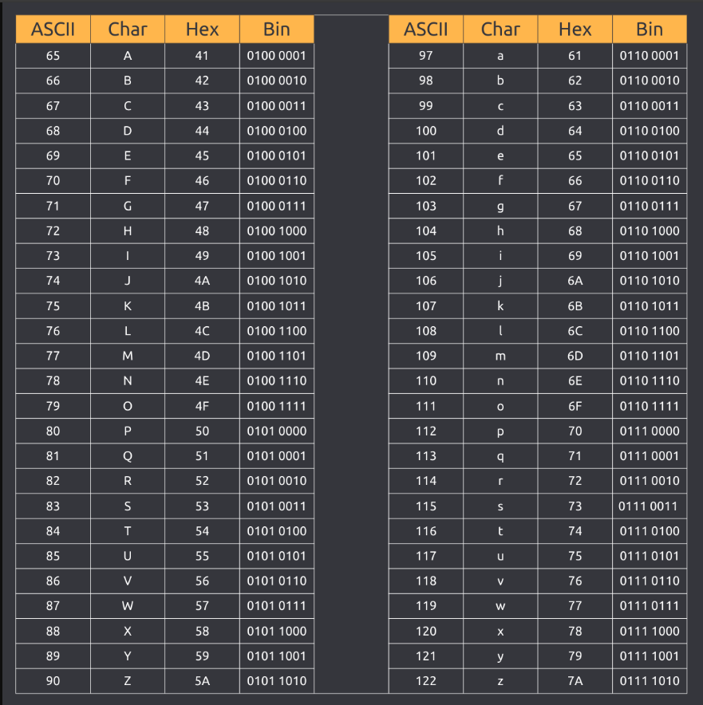

# Hashing — Lesson 17 Notes

> Based on *L17 Slides – Hashing* (CFGDegree → Full‑Stack Stream). These notes turn the slides into a concise study guide with examples and small practice tasks.

---

## Agenda

1. Hashing concept explained  
2. Hashing implementation  
3. Practice and coding

---

## 1) What is Hashing?

Hashing is the process of transforming an input (**key**) into a fixed-size **hash value** (usually an integer) via a **hash function**. In data structures, we use this value to index into an array-backed structure called a **hash table** (also known as hashmap, map, unordered map, or dictionary). Lookups, inserts, and deletes can be **O(1) average time** when the table is well-sized and the hash function distributes keys uniformly.

**Key terms**

- **Hash function**: converts a key into an array index (an integer).  
- **Hash table (hash map)**: an array plus hashing logic that lets us use flexible keys (strings, objects via custom hashing) instead of only sequential integers.
    - A hash table (object in JavaScript or a dictionary in Python)
    organizes data so you can quickly look up values for a given
    key. 
    - Think of a hashmap as a "hack" on top of an array to let us use
    flexible keys instead of being stuck with sequential integer
    "indices." 
- **Hash Value:** The output is a fixed-length string that represents the input data.
- **Collision**: when two different keys hash to the same array index.  
- **Collision resolution**: strategy for storing/retrieving multiple keys that map to the same index.

> Synonyms you’ll see: *hash, hashmap, map, unordered_map (C++), dictionary (Python), object (JavaScript, conceptually)*.

**Key Operators:**
- *Insert Somethinf*
- *delete*    Key : value
- *Look up/ find*    Key  :  value

### Why Hashing is Useful

Hashing is widely used because it is fast and efficient. Some common applications include:
- Data Storage: Hashing helps store and retrieve data quickly in structures like hash tables.
- Password Security: Instead of storing passwords directly, websites store their hash values. This ensures that even if the database is hacked, the original passwords remain secure.
- Data Integrity: Hashing verifies that data hasn’t been tampered with. For example, when downloading a file, its hash value can confirm it’s the original file.
- Blockchain: Cryptocurrencies like Bitcoin use hashing to ensure the integrity of transaction records.

### Examples
Setup
- Table size = 5 → valid indices: 0..4
- Toy hash function (for demo):
    h(word) = (sum of letter positions A=1..Z=26) % 5
    (This is just for teaching; real hash functions differ.)

**Further example - use ascii**

**Link for character codes:** https://developer.mozilla.org/en-US/docs/Web/JavaScript/Reference/Global_Objects/String/charCodeAt

*Insert 1 — "CAT"*
- *Letters:* C=3, A=1, T=20 → sum = 3+1+20 = 24
- Index: 24 % 5 = **4**
- Place "CAT" at index 4.

```makefile
Index:  0   1   2   3   4
Value: [ ] [ ] [ ] [ ] [CAT]
```
**ASCII Example** *UPPERCASE* (would be different if in lowercase)
C=67, A=65, T=84 → CAT sum = 67+65+84 = 216
CAT → 216 % 5 = 1
Index:   0        1          2        3     4
Bucket: [ ]   [ CAT ]       [ ]     [ ]    [ ]


*Insert 2 — "DOG"*
- D=4, O=15, G=7 → sum = 4+15+7 = 26
- Index: 26 % 5 = **1**
- Place "DOG" at index 1.

Index:  0   1    2   3   4
Value: [ ] [DOG] [ ] [ ] [CAT]

**ASCII Example** *UPPERCASE*
D=68, O=79, G=71 → DOG sum = 68+79+71 = 218
DOG → 218 % 5 = 3
Index:   0        1          2        3         4
Bucket: [ ]   [ CAT ]       [ ]     [DOG ]    [ ]

---

## 2) Why collisions happen (and why that’s okay)

No practical hash function is perfect. Given a finite array and many possible keys, some keys will map to the same slot. This is expected—not a bug. Good hash tables choose a collision strategy so that operations remain fast **on average**.

A useful intuition is the **Birthday Paradox**: collisions in small groups are more likely than our intuition suggests. In hashing, this reminds us not to panic when collisions appear—they’re normal and accounted for by the design.

**Back to our little array**
*Insert 3 — "RAT" (shows a collision)*
- R=18, A=1, T=20 → sum = 18+1+20 = 39
- Index: 39 % 5 = **4** *(but this index is already taken up by acat)*
**Collision: index 4 already has "CAT".**

---

## 3) Collision Resolution Strategies

There are many strategies; here are two foundational ones.

### A) Separate Chaining (a.k.a. chaining)

- Each array slot holds a **bucket** (often a linked list or dynamic array).  
- When multiple keys hash to the same index, we **append** them into that bucket.  
- Lookup involves hashing to find the bucket, then scanning just that bucket.
**Back to the Simple Example**
A) Separate Chaining
- Keep a small list (bucket) at each index.
- Append "RAT" to the bucket at index 4.

Index:   0     1        2   3        4
Bucket: [ ]  [DOG]     [ ] [ ]   [CAT → RAT]
Lookup "RAT": hash to 4, scan the bucket → found.

**ASCII Example** *UPPERCASE*
R=82, A=65, T=84 → RAT sum = 82+65+84 = 231
RAT → 231 % 5 = 1 ← collision with CAT
Index:   0        1                 2        3        4
Bucket: [ ]   [ CAT → RAT ]       [ ]     [ DOG ]    [ ]
**Lookup "RAT": hash to 1 → scan bucket → found.**

**Pros**  
- Simple to implement.  
- Table never “fills up” because buckets can grow.  

**Cons**  
- Extra memory for buckets (node pointers, etc.).  
- If one bucket grows large (poor distribution or high load), lookups degrade toward **O(k)** where *k* is bucket size.

**Tiny example (conceptual)**

```
index:   0      1            2         3
bucket: [ ]   [A→B→C]      [ ]       [D→E]
```

**JavaScript (separate chaining) minimal implementation**

```js
class HashMap {
  constructor(initialCapacity = 8) {
    this.buckets = Array.from({ length: initialCapacity }, () => []);
    this.size = 0;
  }

  // djb2-style string hash (simple demo; not cryptographic)
  _hash(key) {
    const str = String(key);
    let hash = 5381;
    for (let i = 0; i < str.length; i++) {
      hash = ((hash << 5) + hash) + str.charCodeAt(i); // hash * 33 + c
      hash |= 0; // keep 32-bit
    }
    return Math.abs(hash);
  }

  _index(key) {
    return this._hash(key) % this.buckets.length;
  }

  set(key, value) {
    const idx = this._index(key);
    const bucket = this.buckets[idx];
    for (const pair of bucket) {
      if (pair.key === key) {
        pair.value = value; // update
        return;
      }
    }
    bucket.push({ key, value }); // insert
    this.size++;
    // optional: resize when load factor > threshold
  }

  get(key) {
    const idx = this._index(key);
    const bucket = this.buckets[idx];
    for (const pair of bucket) {
      if (pair.key === key) return pair.value;
    }
    return undefined;
  }

  has(key) {
    return this.get(key) !== undefined;
  }

  delete(key) {
    const idx = this._index(key);
    const bucket = this.buckets[idx];
    const pos = bucket.findIndex(p => p.key === key);
    if (pos !== -1) {
      bucket.splice(pos, 1);
      this.size--;
      return true;
    }
    return false;
  }
}

// Demo
const m = new HashMap();
m.set("apple", 1);
m.set("papel", 2); // likely to collide with "apple" in small tables
console.log(m.get("apple")); // 1
console.log(m.get("papel")); // 2
```

**Python (separate chaining) minimal implementation**

```python
class HashMap:
    def __init__(self, initial_capacity=8):
        self.buckets = [[] for _ in range(initial_capacity)]
        self.size = 0

    def _hash(self, key):
        s = str(key)
        h = 5381
        for ch in s:
            h = ((h << 5) + h) + ord(ch)  # h*33 + ord(ch)
            h &= 0xFFFFFFFF
        return h

    def _index(self, key):
        return self._hash(key) % len(self.buckets)

    def set(self, key, value):
        idx = self._index(key)
        bucket = self.buckets[idx]
        for i, (k, _) in enumerate(bucket):
            if k == key:
                bucket[i] = (key, value)
                return
        bucket.append((key, value))
        self.size += 1

    def get(self, key, default=None):
        idx = self._index(key)
        for k, v in self.buckets[idx]:
            if k == key:
                return v
        return default

    def delete(self, key):
        idx = self._index(key)
        bucket = self.buckets[idx]
        for i, (k, _) in enumerate(bucket):
            if k == key:
                bucket.pop(i)
                self.size -= 1
                return True
        return False
```

---

### B) Linear Probing (a form of Open Addressing)

- Keep a **single array**; when a slot is occupied, probe forward (wrapping around) to find the **next free slot**.  
- On lookup, probe forward until you either find the key or return to a sentinel (empty) state.

**Pros**  
- Memory-efficient (no extra node objects).  
- Cache-friendly (contiguous memory).

**Cons**  
- Implementation is trickier (especially deletes).  
- Clustering can occur; performance depends on **load factor**.  
- The table can become “full,” requiring a **rehash/resize** step.
 **Back to the simple example:**
 B) Linear Probing (Open Addressing)
- Stay in the array; move forward to find the next empty slot.
- Index 4 is taken → try (4+1) % 5 = 0 → empty → put "RAT" at 0.

Index:  0    1    2   3   4
Value: [RAT][DOG][ ] [ ] [CAT]
**Lookup "RAT": hash to 4, check 4 (CAT ≠ RAT), step to 0 → found.**
**Tiny js code demo**
```js
function hashWord(word, size = 5) {
      // `size` is the hash table size; default to 5 if not provided.
  // The final hash will be an integer in the range [0, size-1].
  const A = "ABCDEFGHIJKLMNOPQRSTUVWXYZ"; // Alphabet for letter → number lookup.
  
  const sum = word.toUpperCase()  // 1) Make the word uppercase so hashing is case-insensitive.
    .split("") // 2) Split into characters.
    .reduce((acc, ch) => acc + (A.indexOf(ch) + 1), 0); // 3) Reduce to the sum of letter positions (A=1, B=2, ..., Z=26).
    //    - `A.indexOf(ch)` returns 0..25 for letters, or -1 if not found.
  //    - We add 1 so A→1, ..., Z→26; for non-letters, (-1 + 1) = 0 (they contribute nothing).

   // Map the (potentially large) sum into a valid table index using modulo.
  return sum % size;  // integer in [0, size-1]

}

console.log(hashWord("CAT")); // 4
console.log(hashWord("DOG")); // 1
console.log(hashWord("RAT")); // 4  (collision with CAT)
```

**ASCII Example**- Linear probing (open addressing)
- Put CAT at 1
- Put DOG at 3
- RAT hashes to 1 (taken) → probe next (1+1)%5 = 2 (empty) → place at 2

Index:  0     1      2      3      4
Value: [ ]   [CAT]  [RAT]  [DOG]  [ ]

**Lookup "RAT": hash to 1 → not it → step to 2 → found.**
```js
function asciiHash(word, size = 5) {
  let sum = 0;
  for (const ch of word) sum += ch.charCodeAt(0); // ASCII/UTF-16 code unit
  return sum % size;
}

console.log(asciiHash("CAT")); // 1
console.log(asciiHash("DOG")); // 3
console.log(asciiHash("RAT")); // 1
```
That’s the basic flow:
- compute a hash → 2) map to an index → 3) handle any collisions → 4) store/retrieve.

**JavaScript (linear probing) minimal implementation**

```js
class LPHashMap {
  constructor(initialCapacity = 8) {
    this.keys = new Array(initialCapacity).fill(null);
    this.values = new Array(initialCapacity).fill(null);
    this.size = 0;
  }

  _hash(key) {
    const str = String(key);
    let hash = 2166136261;
    for (let i = 0; i < str.length; i++) {
      hash ^= str.charCodeAt(i);
      hash = (hash * 16777619) >>> 0; // FNV-1a style (demo only)
    }
    return hash >>> 0;
  }

  _findSlot(key) {
    const cap = this.keys.length;
    let idx = this._hash(key) % cap;
    while (true) {
      const k = this.keys[idx];
      if (k === null || k === key || k === LPHashMap.TOMBSTONE) return idx;
      idx = (idx + 1) % cap;
    }
  }

  _resize(newCap) {
    const oldKeys = this.keys;
    const oldValues = this.values;
    this.keys = new Array(newCap).fill(null);
    this.values = new Array(newCap).fill(null);
    this.size = 0;
    for (let i = 0; i < oldKeys.length; i++) {
      const k = oldKeys[i];
      if (k !== null && k !== LPHashMap.TOMBSTONE) {
        this.set(k, oldValues[i]);
      }
    }
  }

  set(key, value) {
    if ((this.size + 1) / this.keys.length > 0.6) {
      this._resize(this.keys.length * 2);
    }
    const idx = this._findSlot(key);
    if (this.keys[idx] === null || this.keys[idx] === LPHashMap.TOMBSTONE) {
      this.size++;
    }
    this.keys[idx] = key;
    this.values[idx] = value;
  }

  get(key) {
    const cap = this.keys.length;
    let idx = this._hash(key) % cap;
    while (true) {
      const k = this.keys[idx];
      if (k === null) return undefined; // empty slot: not found
      if (k === key) return this.values[idx];
      idx = (idx + 1) % cap;
    }
  }

  delete(key) {
    const cap = this.keys.length;
    let idx = this._hash(key) % cap;
    while (true) {
      const k = this.keys[idx];
      if (k === null) return false;
      if (k === key) {
        this.keys[idx] = LPHashMap.TOMBSTONE; // mark deleted
        this.values[idx] = null;
        this.size--;
        return true;
      }
      idx = (idx + 1) % cap;
    }
  }
}
LPHashMap.TOMBSTONE = Symbol("deleted");

// Demo
const t = new LPHashMap();
t.set("A", 10);
t.set("B", 20);
t.set("C", 30);
console.log(t.get("B")); // 20
t.delete("B");
console.log(t.get("B")); // undefined (after probing)
```

**Python (linear probing) minimal implementation**

```python
class LPHashMap:
    TOMBSTONE = object()

    def __init__(self, initial_capacity=8):
        self.keys = [None] * initial_capacity
        self.values = [None] * initial_capacity
        self.size = 0

    def _hash(self, key):
        s = str(key)
        h = 2166136261
        for ch in s:
            h ^= ord(ch)
            h = (h * 16777619) & 0xFFFFFFFF
        return h

    def _find_slot(self, key):
        cap = len(self.keys)
        idx = self._hash(key) % cap
        while True:
            k = self.keys[idx]
            if k is None or k is self.TOMBSTONE or k == key:
                return idx
            idx = (idx + 1) % cap

    def _resize(self, new_cap):
        old_keys, old_vals = self.keys, self.values
        self.keys = [None] * new_cap
        self.values = [None] * new_cap
        self.size = 0
        for k, v in zip(old_keys, old_vals):
            if k is not None and k is not self.TOMBSTONE:
                self.set(k, v)

    def set(self, key, value):
        if (self.size + 1) / len(self.keys) > 0.6:
            self._resize(len(self.keys) * 2)
        idx = self._find_slot(key)
        if self.keys[idx] is None or self.keys[idx] is self.TOMBSTONE:
            self.size += 1
        self.keys[idx] = key
        self.values[idx] = value

    def get(self, key, default=None):
        cap = len(self.keys)
        idx = self._hash(key) % cap
        while True:
            k = self.keys[idx]
            if k is None:
                return default
            if k == key:
                return self.values[idx]
            idx = (idx + 1) % cap

    def delete(self, key):
        cap = len(self.keys)
        idx = self._hash(key) % cap
        while True:
            k = self.keys[idx]
            if k is None:
                return False
            if k == key:
                self.keys[idx] = self.TOMBSTONE
                self.values[idx] = None
                self.size -= 1
                return True
            idx = (idx + 1) % cap
```

---

## 4) Real‑World Hash Tables (Built‑ins)

- **Python**: `dict` is a highly optimized hash table using open addressing with clever probing and versioned algorithms.  
- **JavaScript**: plain objects (`{}`) are *conceptually* maps keyed by strings/symbols (with prototype caveats); `Map` is an ordered hash map with more predictable semantics.  
- **Java**: `HashMap<K,V>` uses buckets (separate chaining), converting long chains to trees in modern JVMs.  
- **C++**: `std::unordered_map` is typically open addressing or buckets depending on impl.

> Built-ins handle resizing, load factors, and edge cases—use them in production unless you’re learning or have special constraints.

---

## 5) Complexity, Load Factor, and Resizing

- **Average**: `insert`, `lookup`, `delete` → **O(1)**.  
- **Worst-case**: can degrade to **O(n)** (e.g., bad hash function or adversarial inputs).  
- **Load factor** `α = size / capacity`: keep `α` under a threshold (e.g., 0.6–0.75) by **resizing** (allocate a bigger array and rehash existing keys).

**Resizing pattern**

```text
if load_factor > threshold:
    new_capacity = capacity * 2
    allocate new arrays/buckets
    re-insert (rehash) all existing keys
```

---

## 6) Choosing/Designing Hash Functions (non-crypto)

- Fast to compute; good **distribution** for expected keys.  
- Avoid trivial patterns (e.g. sum of chars only).  
- Common demo choices include djb2, FNV-1a—fine for learning, **not** for security.

> **Note (security):** Cryptographic hashing (SHA‑256, etc.) serves different goals (preimage resistance, collision resistance) and is not a drop‑in replacement for table indexing.

---

## 7) Worked Example

Suppose we store student IDs by email.

1. Compute index `i = hash(email) % capacity`.  
2. If using **chaining**: push `(email → studentId)` into bucket `i`.  
3. If using **linear probing**: if slot `i` taken, try `i+1, i+2, …` until a free slot; on lookup, probe similarly.

---

## 8) Practice & Coding Tasks

1. **Implement chaining with arrays**  
   - Replace linked lists with simple JS arrays in each bucket.  
   - Add a `keys()` method that returns all keys in order of buckets.

2. **Probe counting (linear probing)**  
   - Add a counter that returns the number of probe steps taken for a `.get(key)`.  
   - Experiment at different load factors to see average probe lengths.

3. **Resize policy**  
   - Implement `resize()` at load factor > 0.7.  
   - Measure how `.get` time changes before/after a resize.

4. **Hash function swap**  
   - Replace the hash function with a trivial one (e.g., return first char code).  
   - Observe performance impacts via many colliding keys.

5. **Adversarial keys**  
   - Generate many strings with identical hashes for your function.  
   - Compare runtime vs. randomly generated keys.

---

## 9) Glossary

- **Bucket**: per-index collection holding zero or more key-value pairs.  
- **Open addressing**: collision resolution by probing alternative indices in the **same** array.  
- **Separate chaining**: collision resolution by attaching an external structure (linked list/array) at each index.  
- **Load factor**: ratio `size / capacity`.  
- **Rehash**: recompute indices when capacity changes (or function changes).

---

## 10) Quick Reference

- Use built-in maps in real code; custom implementations are excellent for learning.  
- Expect collisions; design to handle them.  
- Keep load factor moderate; resize when necessary.  
- Choose a simple, fast non-crypto hash for table indexing; use crypto hashes for security use-cases.

---

*End of notes.*
