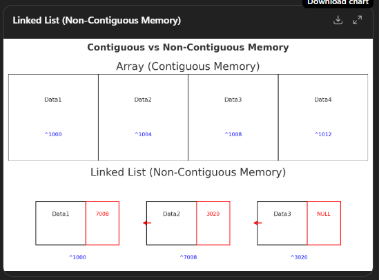
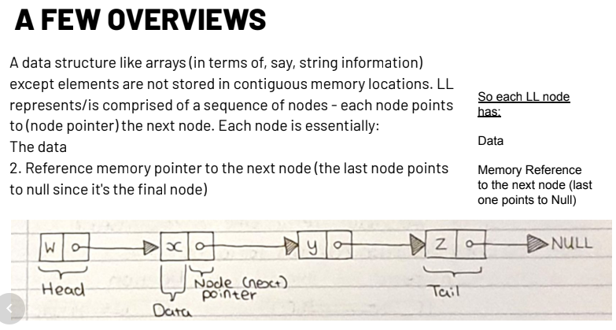
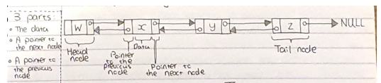
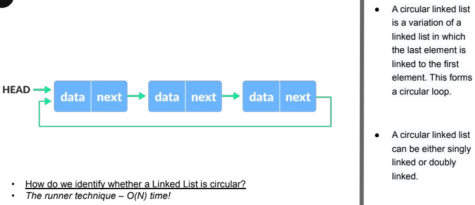

# Linked Lists

## 1. Introduction to Linked Lists

A **linked list** is a data structure similar to arrays in that it can store data, but its elements are *not stored in contiguous memory locations*.

- In memory, **"contiguous"** means that *items are stored right next to each other*, in consecutive memory addresses — like numbered seats in a row.



- **Arrays:** All elements sit next to each other in memory.

    - If the first element is at memory address 1000 and each element takes 4 bytes, the second will be at 1004, the third at 1008, and so on.

    - This is why arrays can do instant `O(1)` access — the computer can jump straight to start_address + (index × element_size).
```css
    [Data1][Data2][Data3][Data4]
 ^1000   ^1004   ^1008   ^1012   (memory addresses in order)
```
WHEREAS:
- **Linked lists:** The elements (nodes) are scattered across memory.

    - Each node can be anywhere, because when you create a node, it’s stored wherever there’s free space in memory.

    - Nodes are connected by pointers (memory addresses) that tell the computer where the next node is.
```css
[Data1|Next=7008]   [Data2|Next=3020]   [Data3|Next=NULL]
   ^1000                ^7008               ^3020
```
Here, the Next part of each node stores the memory address of the next node.

Each linked list node contains:
- **Data** (value stored in the node)
- **Memory reference (pointer)** to the next node (the last node points to `null`)



**Visual Examples**
Array (contiguous)
``css
[Data1][Data2][Data3][Data4]
 ^1000   ^1004   ^1008   ^1012   (memory addresses in order)
```

Linked List (non-contiguous)
```css
[Data1|Next=7008]   [Data2|Next=3020]   [Data3|Next=NULL]
   ^1000                ^7008               ^3020
```
Here, the Next part of each node stores the memory address of the next node.

*In short:*

- Contiguous (arrays): Stored in one block → faster access but harder to resize.

- Non-contiguous (linked lists): Scattered in memory → slower access but easy to insert/remove nodes.

### Key Differences from Arrays
- **Array Access:** `O(1)` time complexity to access an element by index.
- **Linked List Access:** `O(n)` time complexity; must start from the head and traverse until the target node is found.
- Easier insertion and deletion compared to arrays.

```python
# Example Node structure in Python
class Node:
    def __init__(self, data):
        self.data = data  # Node data
        self.next = None  # Pointer to the next node
```
```js
// Example Node structure in JavaScript
class Node {
  constructor(data) {
    this.data = data;   // Node data
    this.next = null;   // Pointer to the next node
  }
}
```
each Node holds some data and a reference (next) to the following node (or null if it’s the last one).

- Can't access a particular element immediatly/ in constant time
    - **In Arrays:** can access 'x' element by it's respective index - hence `O(1)` access
    - **In LL:** need to traverse N elements (nodees?) to access 'x' - so `O(n)`. *(start from the head and traverse because we don't have indexes **so LINEAR time access** instead)

---

## 2. Advantages of Linked Lists
1. **Dynamic size:** Can easily grow or shrink.
2. **Ease of insertion/deletion:** No need to shift elements like in arrays.

Structures like List, Tuple have fixed size. Inserting a new element in an array of elements is expensive because the room has to be created for the new elements and to create room existing elements have to be shifted.

---

## 3. Disadvantages of Linked Lists
1. **No random access:** Must traverse sequentially from the head.
2. **Extra memory overhead:** Each node stores a pointer.
3. **Not cache-friendly** due to scattered memory allocation.
4. **Complexity:** code to maintain the list can be complex
5. May only be able to traverse 1 way
6. Access can be slower than an array

💡 **Note:** Insertion at the start is always **O(1)**, but insertion in the middle requires traversal (**O(n)**).

---

## 4. Types of Linked Lists

### Singly Linked List
- Each node points to the next node only.


```python
# Singly Linked List Node
class Node:
    def __init__(self, data):
        self.data = data
        self.next = None
```
```js
// Example Node structure in JavaScript
class Node {
  constructor(data) {
    this.data = data;   // Node data
    this.next = null;   // Pointer to the next node
  }
}
```

### Real-life example:**
building a *to-do list app* where each task is linked to the next task.
You don’t know how many tasks a user will add, and you want to easily insert or remove tasks.
A linked list works well because it can grow dynamically and handles insertions/deletions efficiently.
```js
// Node class (represents a single task)
class Node {
  constructor(task) {
    this.task = task;   // The task description
    this.next = null;   // Pointer to the next task
  }
}

// LinkedList class (represents the full task list)
class TaskList {
  constructor() {
    this.head = null; // Start with an empty list
  }

  // Add a new task at the end
  addTask(task) {
    const newNode = new Node(task);
    if (!this.head) {
      this.head = newNode;
      return;
    }
    let current = this.head;
    while (current.next) {
      current = current.next;
    }
    current.next = newNode;
  }

  // Remove the first task (when it's done)
  completeTask() {
    if (!this.head) {
      console.log("No tasks to complete!");
      return;
    }
    console.log(`Completed: ${this.head.task}`);
    this.head = this.head.next; // Move head to the next node
  }

  // Show all tasks
  showTasks() {
    let current = this.head;
    let result = "Tasks: ";
    while (current) {
      result += current.task + " -> ";
      current = current.next;
    }
    result += "None";
    console.log(result);
  }
}

// Example usage:
const tasks = new TaskList();
tasks.addTask("Buy groceries");
tasks.addTask("Do laundry");
tasks.addTask("Finish coding project");

tasks.showTasks();  
// Output: Tasks: Buy groceries -> Do laundry -> Finish coding project -> None

tasks.completeTask();  
// Output: Completed: Buy groceries

tasks.showTasks();  
// Output: Tasks: Do laundry -> Finish coding project -> None
```

### Another example:
Music Playlist (Singly Linked List)
- a music app where each song points to the next song in the playlist.
- Each node = a song (title, artist, duration).
- next = pointer to the next song in the queue.
- When the current song ends, the app moves to the next.
- If you add a new song at the end, it just gets linked to the last one.
```js
// Node class (represents a song in the playlist)
class Song {
  constructor(title, artist) {
    this.title = title;
    this.artist = artist;
    this.next = null; // pointer to the next song
  }
}

// Playlist class (singly linked list of songs)
class Playlist {
  constructor() {
    this.head = null; // start empty
  }

  // Add a new song at the end
  addSong(title, artist) {
    const newSong = new Song(title, artist);
    if (!this.head) {
      this.head = newSong;
      return;
    }
    let current = this.head;
    while (current.next) {
      current = current.next;
    }
    current.next = newSong;
  }

  // Play songs in order
  play() {
    let current = this.head;
    if (!current) {
      console.log("Playlist is empty!");
      return;
    }
    while (current) {
      console.log(`Now playing: "${current.title}" by ${current.artist}`);
      current = current.next;
    }
    console.log("End of playlist 🎶");
  }
}

// Example usage:
const playlist = new Playlist();
playlist.addSong("Shape of You", "Ed Sheeran");
playlist.addSong("Blinding Lights", "The Weeknd");
playlist.addSong("Levitating", "Dua Lipa");

playlist.play();
/*
Now playing: "Shape of You" by Ed Sheeran
Now playing: "Blinding Lights" by The Weeknd
Now playing: "Levitating" by Dua Lipa
End of playlist 🎶
*/
```

**What is 'constructor'?**
In JavaScript, the `constructor` keyword is a special *method inside a class*.

What it does:
- It runs automatically whenever you create a new object from the class (using new).
- It’s used to initialize properties of the object.

Example:
```js
class Node {
  // The constructor method is called when you do "new Node(data)"
  constructor(data) {
    this.data = data;   // set the data property
    this.next = null;   // set the next property to null
  }
}

const firstNode = new Node(10);  // constructor runs here
console.log(firstNode.data); // 10
console.log(firstNode.next); // null
```
- Each class can only have one constructor.
- If you don’t define a constructor, JavaScript adds an empty one by default.
- You can pass parameters to it (like data above) to customize the new object.

---

### Doubly Linked List
- Each node has **two pointers**: one to the next node and one to the previous node.
- Allows traversal in both directions.
- Requires extra memory for the additional pointer.
- One pointer goes in one direction while another goes in the other??


```python
# Doubly Linked List Node
class DoublyNode:
    def __init__(self, data):
        self.data = data
        self.next = None
        self.prev = None
```
```js
// Example Node structure in JavaScript
class DoublyNode {
  constructor(data) {
    this.data = data;   // Node data
    this.next = null;   // Pointer to the next node 
    this.prev = null;   // pointer to the previous node
  }
}
```
```js
// Node for Doubly Linked List
class DoublyNode {
  constructor(data) {
    this.data = data;   // The value stored in the node
    this.next = null;   // Pointer to the next node
    this.prev = null;   // Pointer to the previous node
  }
}

// Doubly Linked List
class DoublyLinkedList {
  constructor() {
    this.head = null;  // First node
    this.tail = null;  // Last node
  }

  // Add a node at the end
  append(data) {
    const newNode = new DoublyNode(data);
    if (!this.head) {
      // If the list is empty
      this.head = newNode;
      this.tail = newNode;
    } else {
      // Link new node at the end
      this.tail.next = newNode;
      newNode.prev = this.tail;
      this.tail = newNode;
    }
  }

  // Traverse forward
  printForward() {
    let current = this.head;
    let result = "Forward: ";
    while (current) {
      result += current.data + " <-> ";
      current = current.next;
    }
    console.log(result + "null");
  }

  // Traverse backward
  printBackward() {
    let current = this.tail;
    let result = "Backward: ";
    while (current) {
      result += current.data + " <-> ";
      current = current.prev;
    }
    console.log(result + "null");
  }
}

// Example usage
const dll = new DoublyLinkedList();
dll.append(1);
dll.append(2);
dll.append(3);

dll.printForward();   // Forward: 1 <-> 2 <-> 3 <-> null
dll.printBackward();  // Backward: 3 <-> 2 <-> 1 <-> null
```
- append → adds nodes at the end.
- printForward → walks from head to tail.
- printBackward → walks from tail back to head.

### Real-world coding example: Browser History Navigation
- Think about how a browser works when you click Back and Forward:
- Each webpage is a node.
- next points to the page you visit after.
- prev points to the page you visited before.
This is exactly how a Doubly Linked List works.
```js
// Node = one webpage
class Page {
  constructor(url) {
    this.url = url;
    this.next = null;
    this.prev = null;
  }
}

// Doubly Linked List = browser history
class BrowserHistory {
  constructor() {
    this.current = null;
  }

  // Visit a new page
  visit(url) {
    const page = new Page(url);
    if (this.current) {
      // Link current page -> new page
      this.current.next = page;
      page.prev = this.current;
    }
    this.current = page; // Move to new page
    console.log(`Visited: ${url}`);
  }

  // Go back
  back() {
    if (this.current && this.current.prev) {
      this.current = this.current.prev;
      console.log(`Back to: ${this.current.url}`);
    } else {
      console.log("No previous page.");
    }
  }

  // Go forward
  forward() {
    if (this.current && this.current.next) {
      this.current = this.current.next;
      console.log(`Forward to: ${this.current.url}`);
    } else {
      console.log("No forward page.");
    }
  }
}

// Example usage
const history = new BrowserHistory();

history.visit("google.com");
history.visit("wikipedia.org");
history.visit("github.com");

history.back();     // Back to: wikipedia.org
history.back();     // Back to: google.com
history.forward();  // Forward to: wikipedia.org
```
- You can move back and forward through the list of pages.
- Each page (node) has a prev and next.
- Inserting new pages (visit) links them at the correct place.

---

### Circular Linked List
- The last node points back to the first node, forming a **loop**.
- Can be **singly** or **doubly** linked.


**Example:**
```js
// Node class
class Node {
  constructor(data) {
    this.data = data;
    this.next = null;
  }
}

// Circular Linked List
class CircularLinkedList {
  constructor() {
    this.head = null;
  }

  // Add node at the end
  append(data) {
    const newNode = new Node(data);
    if (!this.head) {
      this.head = newNode;
      newNode.next = this.head; // point to itself (loop)
      return;
    }

    let current = this.head;
    while (current.next !== this.head) {
      current = current.next;
    }
    current.next = newNode;
    newNode.next = this.head; // complete the loop
  }

  // Display the list (be careful: it's a loop!)
  display(limit = 10) { // limit prevents infinite loops
    let current = this.head;
    let count = 0;
    let result = "";
    while (current && count < limit) {
      result += current.data + " -> ";
      current = current.next;
      count++;
    }
    console.log(result + "(back to head)");
  }
}

// Example usage
const cll = new CircularLinkedList();
cll.append(1);
cll.append(2);
cll.append(3);

cll.display(); // 1 -> 2 -> 3 -> (back to head)
```

### Real World Application: Routn Robin Task Scheduler
In operating systems, a round-robin scheduler runs processes in a loop:
- Each process gets a time slice.
- After the last process, it goes back to the first.
- This loop continues until all processes are finished.

This is exactly a circular linked list:
- Each node = a process.
- `next` = the next process in the queue.
- When you reach the last node, it loops back to the head.
```js
class Process {
  constructor(name) {
    this.name = name;
    this.next = null;
  }
}

class RoundRobinScheduler {
  constructor() {
    this.head = null;
    this.current = null;
  }

  addProcess(name) {
    const newProcess = new Process(name);
    if (!this.head) {
      this.head = newProcess;
      newProcess.next = this.head;
      this.current = this.head;
    } else {
      let temp = this.head;
      while (temp.next !== this.head) {
        temp = temp.next;
      }
      temp.next = newProcess;
      newProcess.next = this.head;
    }
  }

  runNext() {
    if (!this.current) {
      console.log("No processes to run.");
      return;
    }
    console.log(`Running process: ${this.current.name}`);
    this.current = this.current.next;
  }
}

// Example usage
const scheduler = new RoundRobinScheduler();
scheduler.addProcess("Process A");
scheduler.addProcess("Process B");
scheduler.addProcess("Process C");

scheduler.runNext(); // Running process: Process A
scheduler.runNext(); // Running process: Process B
scheduler.runNext(); // Running process: Process C
scheduler.runNext(); // Running process: Process A (loop restarts)
```

### Real-world Analogy 2: Multiplayer Game Turn System
In a game with players taking turns:
- After the last player, it goes back to the first player.
- A circular linked list is a natural fit.
```js
class Player {
  constructor(name) {
    this.name = name;
    this.next = null;
  }
}

class TurnSystem {
  constructor() {
    this.head = null;
    this.current = null;
  }

  addPlayer(name) {
    const newPlayer = new Player(name);
    if (!this.head) {
      this.head = newPlayer;
      newPlayer.next = this.head;
      this.current = this.head;
    } else {
      let temp = this.head;
      while (temp.next !== this.head) {
        temp = temp.next;
      }
      temp.next = newPlayer;
      newPlayer.next = this.head;
    }
  }

  nextTurn() {
    if (!this.current) {
      console.log("No players in the game.");
      return;
    }
    console.log(`It's ${this.current.name}'s turn!`);
    this.current = this.current.next;
  }
}

// Example usage
const game = new TurnSystem();
game.addPlayer("Alice");
game.addPlayer("Bob");
game.addPlayer("Charlie");

game.nextTurn(); // It's Alice's turn!
game.nextTurn(); // It's Bob's turn!
game.nextTurn(); // It's Charlie's turn!
game.nextTurn(); // It's Alice's turn! (loop restarts)
```

---

## 5. Detecting a Circular Linked List – The Runner Technique
Some LL can be circular; it can be very difficult to detect whether an LL is acyclic (not a cycle/circular) or cyclic, especially if you cannot modify the LL


The **Runner Technique** (also called the "tortoise and hare" algorithm) uses two pointers:
1. **Slow pointer** moves one step at a time.
2. **Fast pointer** moves two steps at a time.
- If they meet, the linked list is circular.
- If the fast pointer reaches `null`, the list is not circular.

```js
// Detect if a linked list is circular - JS
function isCircular(head) {
  let slow = head;
  let fast = head;

  while (fast && fast.next) {
    slow = slow.next;        // move 1 step
    fast = fast.next.next;   // move 2 steps
    if (slow === fast) {
      return true;  // they met → list is circular
    }
  }
  return false; // fast reached null → not circular
}
```

```python
# Detect if linked list is circular - PY
def is_circular(head):
    slow = head
    fast = head
    while fast and fast.next:
        slow = slow.next
        fast = fast.next.next
        if slow == fast:
            return True
    return False
```

---

## 6. Example Linked List Implementation

```python
class Node:
    def __init__(self, data):
        self.data = data
        self.next = None

class LinkedList:
    def __init__(self):
        self.head = None

    def append(self, data):
        new_node = Node(data)
        if not self.head:
            self.head = new_node
            return
        last = self.head
        while last.next:
            last = last.next
        last.next = new_node

    def display(self):
        current = self.head
        while current:
            print(current.data, end=" -> ")
            current = current.next
        print("None")

# Example usage
ll = LinkedList()
ll.append(1)
ll.append(2)
ll.append(3)
ll.display()  # Output: 1 -> 2 -> 3 -> None
```

---

## 7. Summary Table

| Feature | Array | Linked List |
|---------|-------|-------------|
| Memory allocation | Contiguous | Scattered |
| Access time | O(1) | O(n) |
| Insertion/deletion | Costly | Easy |
| Extra memory | None | Pointer overhead |

---

## 8. Exercises
- Implement **insert_at_position**
- Implement **delete_node**
- Detect if a list is **palindromic**
