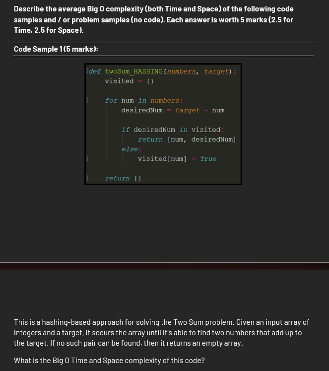
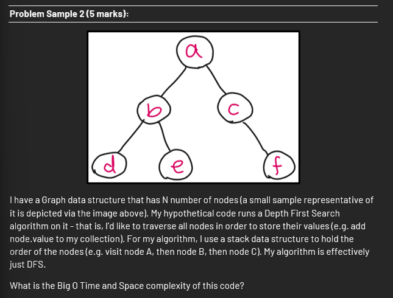
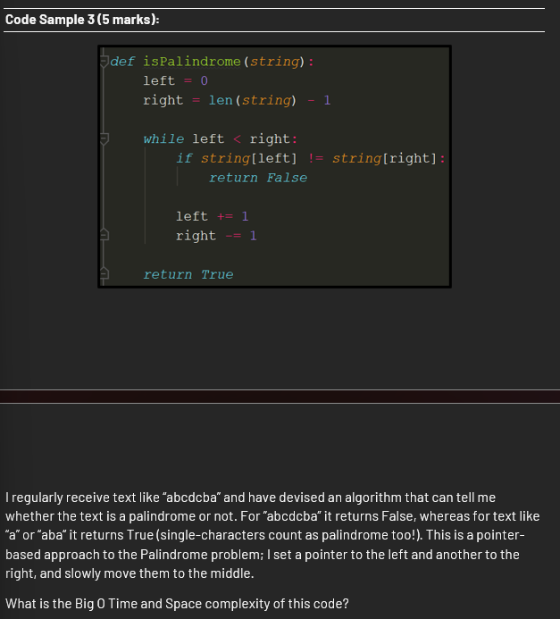

# Specialization Practice Questions

---

## Contents
Q1. Calc Tame and Space Complexity of a for loop with if else.


---

## Q1. Calc Tame and Space Complexity of a for loop with if else


```python
def two_sum_hashing(numbers, target):
    """
    Find any two values in `numbers` that sum to `target`.
    Returns the pair as a list [a, b]; returns [] if no pair exists.
    """

    visited = {}           # Hash table to record numbers we've seen so far.
                           # (A set() would also work; the True value is a placeholder.)

    for num in numbers:    # Walk through the list once, left to right.
        desired = target - num        # What number would complete the sum to `target`?
        if desired in visited:        # O(1) average: have we seen that complement already?
            return [num, desired]     # Yes → we found a valid pair; return immediately.
        else:
            visited[num] = True       # No → remember current number for future checks.

    return []               # Exhausted the list without finding a pair.

```

**Notes** 
- Define n: let 𝑛 be the length of numbers.
- Control flow: there’s one loop over numbers; no nested loops.
- Per-iteration work:
    - arithmetic: target - num → constant time.
    - hash-table lookup: desiredNum in visited → think average-case lookup cost for a Python dict/set.
    - hash-table insert: visited[num] = True → think average-case insert cost for a dict/set.

- Early return vs average: it may return early when a pair is found. For average-case Big-O, reason about how many elements you’d expect to see before finding a pair (hint: proportional to 𝑛, constant factors don’t change the class).
- Space growth: what’s the largest number of distinct items that can end up in visited before returning or finishing?

- Compose time complexity: (number of iterations) × (average cost per iteration).
    - **Time (average): O(n) → single pass over numbers; dict lookups/inserts are O(1) on average** 

- Compose space complexity: size of auxiliary data structures relative to 
𝑛 (ignore input storage).
    - **Space: O(n) → the visited hash table can grow to hold up to all seen elements (up to 𝑛) if no pair is found until the end.**

Optional check: compare with best case (pair found immediately) and worst case (no pair exists) to sanity-check your average-case conclusion.

---

## Q2 Time/Space COmplexity



- *Name your symbols:* 
    - let 𝑉= number of vertices (nodes), E = number of edges. If it’s a tree, remember 
        𝐸 = 𝑉 − 1
        E=V−1.

**What operation happens how many times?**
- Each vertex is *discovered once and finished once* (pushed to / popped from the stack once each).

-Each edge is looked at a *constant number of times* (once per direction for undirected graphs).

**Traversal vs. search:**

- A *BST (Binary Search Tree)* search is where the log 𝑉 intuition comes from (you’re halving the search space).

- A *DFS (Depth First Search)* traversal that aims to “visit all nodes” does not halve anything; it systematically touches every reachable vertex (and edges to get there).

**Representation matters:**

- With an adjacency list, counting visits to vertices and adjacency lists leads to a total cost *proportional to “vertices + edges”.*

- With an adjacency matrix, *scanning neighbors costs proportional to  𝑉 per vertex.*

**Space accounting:**

You typically maintain a visited set (or color array) to avoid revisiting cycles → how big can that get relative to V?

The explicit stack (or recursion stack) grows with the current path length (i.e., the depth):

For a balanced tree, depth ~ logV.

For a path-like tree (degenerate), depth ~ 
𝑉
V.

For general graphs, worst-case path length is also bounded by V.

Sanity checks:

If you must “touch” every node to collect values, the running time must scale with at least the number of nodes.

For a tree, substitute 
𝐸 =𝑉 − 1
E=V−1 into your expression to simplify.

Changing recursion ↔ stack doesn’t change Big-O, only constants.
Time: can’t be O(1)—to “collect all node values” you must visit every node and follow their edges. DFS time is O(V + E) (nodes + edges). For a tree, that simplifies to O(n) because 
E=n−1.

Space: your guess is closer. DFS needs memory for the visited set (in graphs) and the stack/recursion path. In the worst case that’s O(V). (On a balanced tree the stack depth is 
O(logn), but in general/worst case it’s 
O(n)).

## Q3 T&S complexity on a palindrome function


Time: O(n), where n is the string length.
You compare at most n/2 character pairs while moving left and right inward; each loop does O(1) work.

Space: O(1) extra space (just two indices).

(Best case can return early after 1 comparison, but worst/average is linear.)