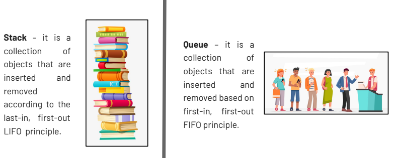

# Stacks & Queues

## Lesson 15 — CFGDegree → Full-Stack Stream

---

## Agenda
1. Data structures: Stack & Queue
2. Queue
3. Stack
4. Practice and coding

---

## Stack and Queue Overview



### Queue
A **queue** is a collection of objects that are inserted and removed based on the **First-In, First-Out (FIFO)** principle.

**Queue Anatomy:**


**Operations:**
- **enqueue**: Adds an item to the queue.  
  _Overflow_ condition if queue is full.
- **dequeue**: Removes an item from the queue (same order they were added).  
  _Underflow_ condition if queue is empty.
- **front**: Get the front item from the queue.
- **rear**: Get the last item from the queue.

**Diagram:**
```
[ front ] -> [ item1, item2, item3, ... ] <- [ rear ]
```

**Key points:**
- First item added is the first one removed.
- Insertion happens at the **rear**.
- Deletion happens at the **front**.

## Queue Implementation

**Example:** a customer service ticket system where tickets arrive and are processed in order.

```javascript
// Import deque
const Deque = require('@datastructures-js/deque');

// Initialize the ticket queue with some initial requests
let ticketQueue = Deque.fromArray([
  { id: 1, customer: "Alice", issue: "Password reset" },
  { id: 2, customer: "Bob", issue: "Payment failed" },
  { id: 3, customer: "Charlie", issue: "App crash report" }
]);

console.log("Initial queue:", ticketQueue.toArray());

// New customers join the queue (enqueue at the back)
ticketQueue.pushBack({ id: 4, customer: "Daisy", issue: "Update billing info" });
ticketQueue.pushBack({ id: 5, customer: "Eve", issue: "Cannot login" });

console.log("After new tickets:", ticketQueue.toArray());

// VIP customer gets priority (enqueue at the front)
ticketQueue.pushFront({ id: 100, customer: "VIP Frank", issue: "Service outage" });

console.log("After VIP ticket:", ticketQueue.toArray());

// Peek at the next ticket to process (front of queue)
console.log("Next ticket:", ticketQueue.front());

// Process tickets in FIFO order
while (!ticketQueue.isEmpty()) {
  const currentTicket = ticketQueue.popFront();
  console.log(`Processing ticket #${currentTicket.id} for ${currentTicket.customer}: ${currentTicket.issue}`);
  console.log("Tickets left:", ticketQueue.size());
}

// Queue is now empty
console.log("All tickets processed. Is empty?", ticketQueue.isEmpty());
```

**How it works in context:**
- `pushBack`: Normal customers join the end of the queue.
- `pushFront`: A VIP customer skips to the front.
- `front`: Peek at who’s next without removing them.
- `popFront`: Process tickets in FIFO order.
- `isEmpty` / `size`: Track progress until the queue is cleared.

extend the ticket queue example to include clone, so we can take a snapshot before processing.
```js
// Import deque
const Deque = require('@datastructures-js/deque');

// Initialize the ticket queue with some initial requests
let ticketQueue = Deque.fromArray([
  { id: 1, customer: "Alice", issue: "Password reset" },
  { id: 2, customer: "Bob", issue: "Payment failed" },
  { id: 3, customer: "Charlie", issue: "App crash report" }
]);

console.log("Initial queue:", ticketQueue.toArray());

// Add new tickets
ticketQueue.pushBack({ id: 4, customer: "Daisy", issue: "Update billing info" });
ticketQueue.pushBack({ id: 5, customer: "Eve", issue: "Cannot login" });

// VIP ticket goes to the front
ticketQueue.pushFront({ id: 100, customer: "VIP Frank", issue: "Service outage" });

console.log("Queue before processing:", ticketQueue.toArray());

// ---- CLONE ----
// Take a snapshot of the current queue before processing
let backupQueue = ticketQueue.clone();

console.log("Cloned snapshot:", backupQueue.toArray());

// Process tickets (FIFO order)
while (!ticketQueue.isEmpty()) {
  const currentTicket = ticketQueue.popFront();
  console.log(`Processing ticket #${currentTicket.id} for ${currentTicket.customer}`);
}

console.log("Queue after processing:", ticketQueue.toArray());  // should be empty
console.log("Backup snapshot still intact:", backupQueue.toArray()); // preserved
```
**Why use clone?**
- Lets you keep a snapshot of the queue at a specific moment.
- Useful if you want to review tickets later (e.g. for logs, audits, or debugging).
- The original queue changes, but the clone stays frozen.

add `clear()` into the workflow — after we’re done with the backup snapshot, we’ll wipe it clean.
```js
// Import deque
const Deque = require('@datastructures-js/deque');

// Initialize the ticket queue with some initial requests
let ticketQueue = Deque.fromArray([
  { id: 1, customer: "Alice", issue: "Password reset" },
  { id: 2, customer: "Bob", issue: "Payment failed" },
  { id: 3, customer: "Charlie", issue: "App crash report" }
]);

console.log("Initial queue:", ticketQueue.toArray());

// Add new tickets
ticketQueue.pushBack({ id: 4, customer: "Daisy", issue: "Update billing info" });
ticketQueue.pushBack({ id: 5, customer: "Eve", issue: "Cannot login" });

// VIP ticket goes to the front
ticketQueue.pushFront({ id: 100, customer: "VIP Frank", issue: "Service outage" });

console.log("Queue before processing:", ticketQueue.toArray());

// ---- CLONE ----
// Take a snapshot of the current queue before processing
let backupQueue = ticketQueue.clone();
console.log("Cloned snapshot:", backupQueue.toArray());

// ---- PROCESS ----
// Process tickets in FIFO order
while (!ticketQueue.isEmpty()) {
  const currentTicket = ticketQueue.popFront();
  console.log(`Processing ticket #${currentTicket.id} for ${currentTicket.customer}`);
}

console.log("Queue after processing:", ticketQueue.toArray());  // should be empty
console.log("Backup snapshot still intact:", backupQueue.toArray()); // preserved

// ---- CLEAR ----
// Once the backup is no longer needed, clear it
backupQueue.clear();
console.log("Backup queue cleared:", backupQueue.toArray()); // []
console.log("Backup queue size:", backupQueue.size()); // 0
console.log("Is backup empty?", backupQueue.isEmpty()); // true
```

**Another Example**
```js
class MyQueue {
  constructor(size) {
    this.q = Array(size)
    this.capacity = size
    this.front = 0
    this.back = -1
    this.count = 0
  }

  append(x) {
    if (this.isFull()) {
      console.log('Queue is full! Terminating process.')
      throw 'stop execution'
    }

    this.back = (this.back + 1) % this.capacity
    this.q[this.back] = x
    this.count = this.count + 1
  }

  pop() {
    if (this.isEmpty()) {
      console.log('Queue Underflow!! Terminating process.')
      throw 'stop execution'
    }
    const top = this.q[this.front]
    this.front = (this.front + 1) % this.capacity
    this.count = this.count - 1
    return top
  }

  peek() {
    if (this.isEmpty()) {
      console.log('Queue is empty!! Terminating process.')
      throw 'stop execution'
    }
    return this.q[this.front]
  }

  size() {
    return this.count
  }

  isEmpty() {
    return this.size() === 0
  }

  isFull() {
    return this.size() === this.capacity
  }
}

q = new MyQueue(5)

q.append(1)
q.append(2)
q.append(3)

console.log("The queue size is", q.size())
console.log("The front element is", q.peek())
q.pop()
console.log("The front element is", q.peek())

q.pop()
q.pop()

if (q.isEmpty()) {
  console.log("The queue is empty")
} else {
  console.log("The queue is not empty")
}
```
**Flow Recap:**
- Create a queue with tickets.
- Add normal + VIP tickets (`pushBack`, `pushFront`).
- Clone the queue as a backup snapshot.
- Process all tickets with popFront.
- Clear the backup snapshot when no longer needed.

---

### Stack
A **stack** is a collection of objects that are inserted and removed according to the **Last-In, First-Out (LIFO)** principle.

**Key points:**
- Last item added is the first one removed.
- Insertion and deletion happen at the **same end** (top).

**Summary:**  
- **STACK → LIFO**  
- **QUEUE → FIFO**  


## Stack Anatomy

**Operations:**
- **empty()** — Returns whether the stack is empty.
- **size()** — Returns the size of the stack.
- **top()** — Returns a reference to the topmost element of the stack.
- **push(x)** — Adds element `x` at the top of the stack.
- **pop()** — Deletes the topmost element of the stack.

**Diagram:**
```
[top] -> [ item_n, ..., item3, item2, item1 ]
```


## Stack Implementation

**Example:** 
we’re building a browser history manager — the last page you visited is the first one you go “back”
```js
// Import deque
const Deque = require('@datastructures-js/deque');

// Initialize stack with some visited pages
let historyStack = Deque.fromArray([
  "home.html",
  "about.html",
  "products.html"
]);

console.log("Initial history:", historyStack.toArray());

// Visit new pages (push onto the stack)
historyStack.push("contact.html");
historyStack.push("faq.html");

console.log("After visiting new pages:", historyStack.toArray());

// Peek at the current page (top of stack)
console.log("Current page:", historyStack.back());

// Go back (pop from the stack, LIFO)
console.log("Going back from:", historyStack.pop());  // faq.html
console.log("Now at:", historyStack.back());          // contact.html

// Go back again
console.log("Going back from:", historyStack.pop());  // contact.html
console.log("Now at:", historyStack.back());          // products.html

// Clone history before clearing (e.g. backup before reset)
let backupHistory = historyStack.clone();
console.log("Backup history snapshot:", backupHistory.toArray());

// Clear history stack (reset browser)
historyStack.clear();
console.log("History after clear:", historyStack.toArray());   // []
console.log("Backup still intact:", backupHistory.toArray());  // preserved snapshot
```

- `push` = visit new page

- `pop` = go back

- `back()` = current page

- `clone()` = save session snapshot

- `clear()` = wipe browsing history

### JavaScript
```javascript
// Using array
let stack = [];
stack.push(1);  // push
stack.pop();    // pop

// Using @datastructures-js/deque
// https://www.npmjs.com/package/@datastructures-js/deque
const Deque = require('@datastructures-js/deque');
const s = new Deque();
s.pushBack(1);  // push
s.popBack();    // pop
```
```js
// example from class
class StackList{

  constructor(size) {

    this.container = Array(size)
    this.capacity = size
    this.top = -1
  }

  push(x) {
    if (this.top + 1 === this.capacity){
      console.log("Stack is full. Cancelling execution")
      throw "stop execution"
    }
    this.top = this.top + 1
    this.container[this.top] = x
  }
  // take off top object
  pop(){
    if (this.top + 1 === 0) {
     console.log("This stack is empty")
     throw "stop execution" 
    }
    const top = this.container[this.top]
    this.top = this.top - 1
    return top
  }
}
```

### Python
```python
# Using list
stack = []
stack.append(1)  # push
stack.pop()      # pop

# Using collections.deque
from collections import deque
s = deque()
s.append(1)  # push
s.pop()      # pop

# Using queue.LifoQueue
from queue import LifoQueue
s = LifoQueue()
s.put(1)  # push
s.get()   # pop
```

---

## Practice & Exercises
Try implementing:
1. A queue using both `list` and `deque` in Python.
2. A stack using `array` in JavaScript.
3. Detect overflow and underflow conditions.

---

**References:**
- https://www.npmjs.com/package/@datastructures-js/deque
- https://docs.python.org/3/library/collections.html#deque-objects
- https://docs.python.org/3/library/queue.html

---

## @datastructures-js/deque

### Install
`npm install --save @datastructures-js/deque`

**require**
`const { Deque } = require('@datastructures-js/deque');`

**import**
import { Deque } from '@datastructures-js/deque';
API

## API

**constructor**
```JS
// empty queue
const deque = new Deque();

// from an array
const deque = new Deque([1, 2, 3]);
```

**Deque.fromArray**
```JS
// empty queue
const deque = Deque.fromArray([]);

// with elements
const list = [10, 3, 8, 40, 1];
const deque = Deque.fromArray(list);

// If the list should not be mutated, use a copy of it.
const deque = Deque.fromArray(list.slice());
```

**pushFront**
adds an element at the front of the queue.
```js
deque.pushFront(30).pushFront(20).pushFront(10);
```

**pushBack**
adds an element at the back of the queue.
```js
deque.pushBack(40).pushBack(50).pushBack(60);
```

**front**
peeks on the front element of the queue.
```js
console.log(deque.front()); // 10
```

**back**
peeks on the back element of the queue.
```js
console.log(deque.back()); // 60
```

**popFront**
removes and returns the front element in the queue.
```js
console.log(deque.popFront()); // 10
console.log(deque.front()); // 20
```

**popBack**
removes and returns the back element in the queue.
```js
console.log(deque.popBack()); // 60
console.log(deque.back()); // 50
```

**isEmpty**
checks if the queue is empty.
```js
console.log(deque.isEmpty()); // false
```

**size**
returns the number of elements in the queue.
```js
console.log(deque.size()); // 4
```

**clone**
creates a shallow copy of the queue.
```js
const deque2 = Deque.fromArray([{ id: 2 }, { id: 4 } , { id: 8 }]);
const clone =  deque2.clone();

clone.popFront();

console.log(deque2.front()); // { id: 2 }
console.log(clone.front()); // { id: 4 }
```

**toArray**
returns a copy of the remaining elements as an array.
```js
console.log(deque.toArray()); // [ 20, 30, 40, 50 ]
```

**clear**
clears all elements from the queue.
```js
deque.clear();
deque.size(); // 0
```

**Build**
```js
grunt build
```

