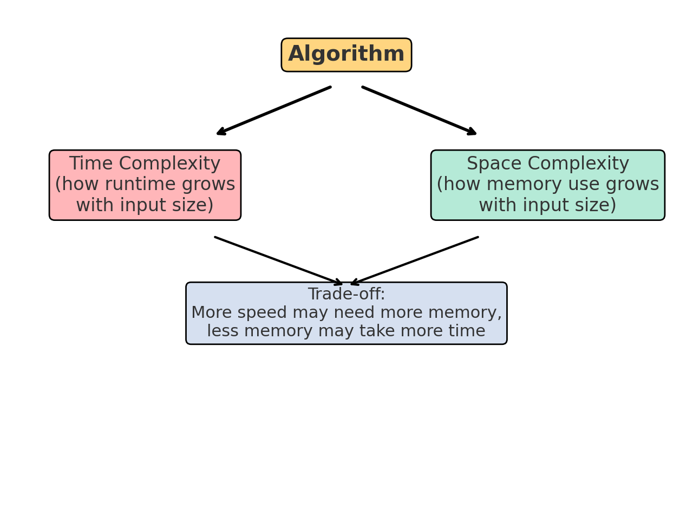
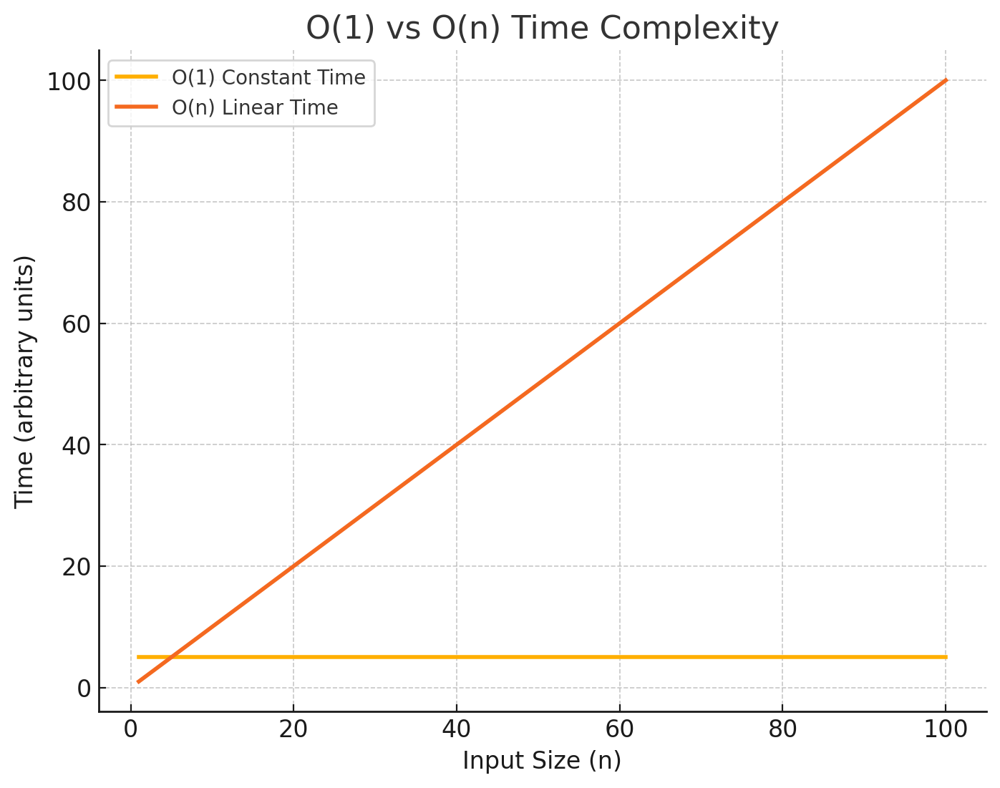
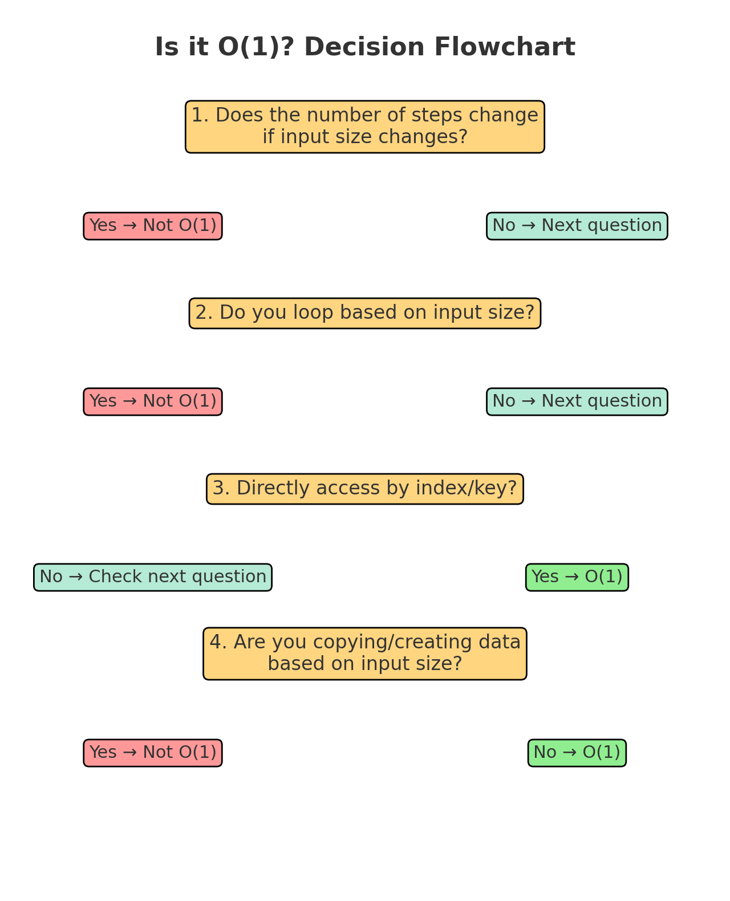

# Time and Space Complexity

## Agenda
1. Complexity Analysis
2. Big O Notation
3. Practice and Coding

---

## Why Learn This?
Many interview processes have **unreasonable expectations** – you might be asked to solve problems you'd never encounter in the job (e.g., inverting a binary tree).  
However:
- These topics are **common in technical interviews** regardless of the role.
- Useful for **career progression** when switching jobs.
- Relevant for understanding algorithm efficiency in **real-world development**.

> **Note:** It's also ideal to revise **OOP concepts** and **networking basics** (TCP/IP, packets, etc.), even though they're not covered here.

---

## Mindset for Learning This
- The content is **difficult**, so **struggling is normal**.
- **Rejection** in interviews is normal – it's not a measure of your talent.
- Factors influencing rejection:
  - Interviewer having a bad day
  - Panic or poor time management during interview
  - Unfamiliarity with a problem-solving technique
- These are **some of the hardest areas in CS** – persistence is key.

---

## Keyword - Algorithm
An algorithm is simply a step-by-step set of instructions for solving a problem or performing a task.

- Think of it as a recipe in cooking:
    - It has a goal (make a cake).
    - It has steps (mix ingredients, preheat oven, bake, cool).
    - If you follow the steps correctly, you get the desired result.

- Key points about algorithms
    - Well-defined – Each step must be clear and unambiguous.
    - Finite – It should finish in a limited number of steps.
    - Input – It can take data to work on (e.g., numbers, text).
    - Output – It produces a result based on the input.
    - Effective – Steps should be simple enough to be carried out.

**Example in plain language**
*Problem:* Find the largest number in a list.
Algorithm:
- Assume the first number is the largest.
- Compare it to the next number.
- If the next number is bigger, update your "largest" value.
-  Continue until you reach the end of the list.
-  Output the "largest" value.
```js
function findLargestNumber(numbers) {
    // Step 1: Assume the first number is largest
    let largest = numbers[0];

    // Step 2: Compare with each number
    for (let i = 1; i < numbers.length; i++) {
        if (numbers[i] > largest) {
            largest = numbers[i]; // Step 3: Update largest if bigger
        }
    }

    // Step 4: Return the largest
    return largest;
}

console.log(findLargestNumber([3, 7, 2, 9, 5])); // Output: 9
```

## Programming Language for Examples
- We'll use **JavaScript** for examples since it’s a primary Full-Stack language.
- **Concepts are universal** – you can practice in Python or any language.
- Benefits:
  - Reinforce JS syntax for Full-Stack development
  - Understand algorithms **independent of language**

---

**Algorithms** and **time/space complexity** are like the *recipe and the cost* of making that recipe.

1️⃣ **Algorithm = *What to do***
An algorithm is the logical sequence of steps to solve a problem.
Example: Finding the largest number in a list (the recipe).

## Complexity Analysis

**Definition:**  
The process of determining how efficient an algorithm is.  
This involves measuring:
- **Time Complexity:** How fast the algorithm runs
- **Space Complexity:** How much auxiliary memory it uses

Why it matters:
- Helps compare algorithms
- Informs decisions about trade-offs between time and space

---

## Time vs Space Complexity

2️⃣ **Time Complexity** = How long it takes
Time complexity *measures how the execution time grows as the input size increases*.
- It’s not about the exact seconds it takes, but how the time scales.
- We use Big O notation to describe this.

3️⃣ **Space Complexity** = How much memory it uses
Space complexity *measures how much extra memory (RAM) the algorithm needs* beyond the input.
- Variables, arrays, and temporary storage all contribute.
- Some algorithms trade time for space, or space for time.



| Term             | Meaning |
|------------------|---------|
| **Time Complexity** | A measure of **execution time** growth relative to input size |
| **Space Complexity** | A measure of **memory usage** growth relative to input size |

Both are expressed in **Big O notation**.

4️⃣ **Why they’re connected**
When we design or choose an algorithm:
- We care about time complexity (speed) for performance.
- We care about space complexity (memory usage) for efficiency.
- Sometimes we trade one for the other:
- A faster algorithm might need more memory.
- A memory-saving algorithm might take longer to run.

✅ **In short:**
- *Algorithm* = the steps to solve a problem
- *Time complexity* = how the runtime grows with input size
- *Space complexity* = how the memory usage grows with input size
Both complexities *help us judge how “good” an algorithm is compared to others*.

---

## Big O Notation

**Purpose:** Describes time or space complexity of algorithms in terms of input size.
- Variables used in Big O notation denote the sizes of inputs to algorithms.

**Variables:**  
`n`, `m` represent sizes of different inputs.

Example:
```javascript
// O(n + m) example: traverse an array of length n and a string of length m
function processArrayAndString(arr, str) {
    for (let i = 0; i < arr.length; i++) {
        // process array element
    }
    for (let j = 0; j < str.length; j++) {
        // process string character
    }
}
```

### Common Big O Complexities
| Complexity   | Big O        | Example |
|--------------|--------------|---------|
| Constant     | `O(1)`       | Accessing an element in an array |
| Logarithmic  | `O(log n)`   | Binary search |
| Linear       | `O(n)`       | Iterating through a list |
| Log-linear   | `O(n log n)` | Merge sort |
| Quadratic    | `O(n^2)`     | Nested loops |
| Cubic        | `O(n^3)`     | Triple nested loops |
| Exponential  | `O(2^n)`     | Recursive Fibonacci |
| Factorial    | `O(n!)`      | Solving the travelling salesman problem with brute force |

#### Complexities in more detail:

#### Constant
When we say Constant time in the context of time complexity, we’re talking about *algorithms whose execution time does not depend on the size of the input*.
**That means:**
- Whether you have 10 items or 10 million items, the operation still takes about the same amount of time.
- The runtime is O(1) — a flat line on a graph of time vs. input size.
- “Constant” doesn’t mean instantaneous — it still takes some time — but the time is fixed for any size of input.
- In Big O, we drop constants like 5, 20, etc., because they don’t scale with input size.
- In Big O, “constant” refers to how the runtime behaves as the input size (n) changes.
    - If the runtime does not change with input size, then it’s O(1) — constant time complexity.
    - But having a literal constant (like the number 5 in code) doesn’t automatically make the algorithm O(1).

**Examples:**
```js
// Accessing the first element of an array
let arr = [10, 20, 30, 40, 50];
console.log(arr[0]); // O(1)
```
**This is O(1) because:**
The computer can *directly jump to the position in memory without looping* through the array.

```js
// Accessing an array element by index O(1)
let arr = [5, 8, 12, 19];
let value = arr[2]; // Always the same time, no matter array size
```
```js
// Inserting/removing at the end of an array (most languages) O(1)
let arr = [1, 2, 3];
arr.push(4); // Add to end — O(1)
arr.pop();   // Remove from end — O(1)
```
(Inserting at the start is NOT O(1) in most languages — it’s O(n) because elements shift.)
```js
// Accessing a property in a hash map / object O(1) 
let user = { name: "Alex", age: 40 };
console.log(user.name); // O(1)
```
```js
// Swapping two variables O(1) 
let a = 5, b = 10;
let temp = a;
a = b;
b = temp; // O(1)
```
Why it matters
- O(1) operations are the most efficient in terms of scaling — 
    - if you can replace an O(n) search with an O(1) lookup (e.g., by using a hash map), you drastically improve performance for large datasets.



**Non O(1) vs O(1) examples:**
```js
function printFiveTimes(arr) {
    for (let i = 0; i < arr.length; i++) { // loops over n items
        console.log(5); // literal constant
    }
}
```
- Even though you’re printing a literal 5, you’re still looping over the entire array.
- Runtime grows with n → O(n), not O(1).
**VS**
```js
function printFive() {
    console.log(5); // literal constant, runs once
}
```
- Only one step, regardless of input size.
- Runtime does not change → O(1).

#### Decision Checklist!
Is it O(1)? Quick Questions to Ask Yourself
Does the number of steps change if the input size changes?

❌ Yes → Not O(1)

✅ No → Could be O(1)

Do you loop through the input (or part of it) based on its size?

    ✅ Any loop that depends on n → Not O(1)

    ✅ Loops with a fixed number of iterations (e.g., for i=1 to 10) → O(1)

Do you directly access a single element by index/key without searching?

    ✅ Example: arr[5] or obj["key"] → O(1)

    ❌ Example: Finding a value in an unsorted list → O(n)

Does the work scale with how much data is in the input?

    ✅ If yes → Not O(1)

    ❌ If no → O(1)

Are you creating or copying data based on input size?

    ✅ If you copy the whole list, string, etc. → Not O(1)

    ❌ If you just make a single variable → O(1)

**Examples**
| Code                    | Complexity | Why                                             |
| ----------------------- | ---------- | ----------------------------------------------- |
| `let x = arr[3];`       | O(1)       | Direct index access, no matter how big `arr` is |
| `arr.push(10);`         | O(1)       | Adding to end in most languages                 |
| Loop over entire array  | O(n)       | Steps grow with `n`                             |
| Copy entire array       | O(n)       | Memory and time grow with `n`                   |
| Nested loops over array | O(n²)      | Work grows with square of `n`                   |

**Flow Chart**


---

## Summary
- **Time Complexity**: Speed of execution relative to input size
- **Space Complexity**: Memory use relative to input size
- **Big O Notation**: Standard way to express complexities
- Mastering these concepts is crucial for **technical interviews** and **efficient coding**.

---

## Practice
- Try implementing algorithms with different complexities.
- Compare `O(n)` vs `O(n^2)` solutions for the same problem.
- Optimise code by reducing unnecessary loops or memory use.

